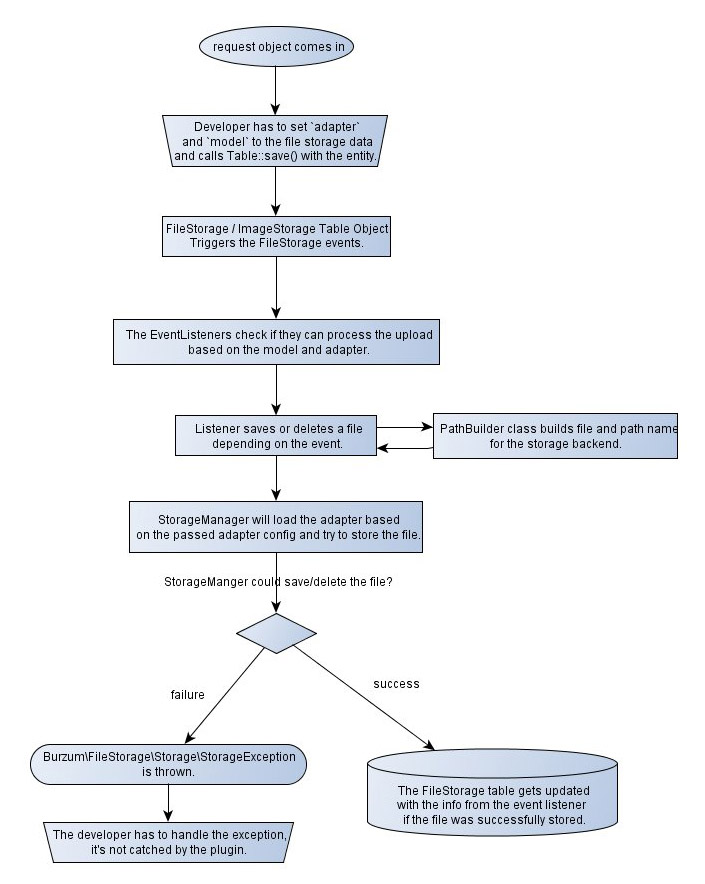

How it works
------------

The whole plugin is build with clear [Separation of Concerns](https://en.wikipedia.org/wiki/Separation_of_concerns) in mind: A file is *always* an entry in the `file_storage` table from the app perspective.

The table is the *reference* to the real place of where the file is stored and keeps some meta information like mime type, filename, file hash (optional) and size as well. You associate the `file_storage` table with your model using the FileStorage or ImageStorage model from the plugin via hasOne, hasMany or HABTM.

When you upload a file you save it to the FileStorage model through the associations, `Documents.file` for example. The FileStorage model dispatches then file storage specific events. The listeners listening to these events process the file and put it in the configured storage backend using adapters for different backends and build the storage path using a path builder class.

